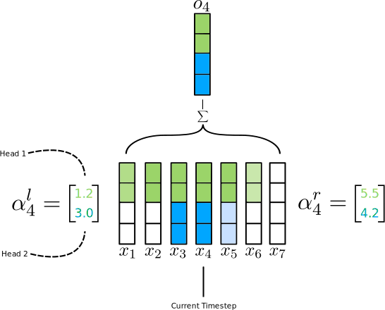
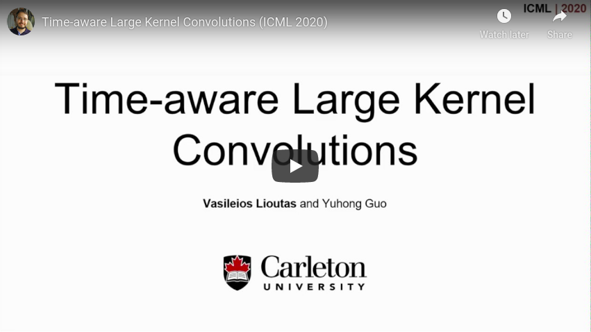

# Time-aware Large Kernel (TaLK) Convolutions (Lioutas et al., 2020)

This repository contains the source code, pre-trained models, as well as instructions to reproduce results for our paper [Time-aware Large Kernel Convolutions](https://arxiv.org/abs/2002.03184) (**ICML 2020**).

<p align="center"></p>

**TaLK Convolutions** is a sequence modeling method that uses an adaptive convolution operation that learns to predict the size of a summation kernel instead of using a fixed-sized learnable kernel matrix. It utilizes a fast parallelized implementation of the summed-area table, also known as the integral image operation, to efficiently calculate the convolution output that uses the summation kernel. We generate relative offsets for each timestep of the input sequence, which are used to adaptively expand the size of the summation kernel conditioned on the input. This method yields a time complexity of O(n), effectively making the sequence encoding process linear to the number of tokens.

### Video Presentation: 

<p align="center"><a href="https://www.youtube.com/watch?v=64K27VwGhs4" target="_blank"></a></p>


## Citation:

```
@inproceedings{lioutas2020timeaware,
    author={Vasileios Lioutas and Yuhong Guo},
    title={Time-aware Large Kernel Convolutions},
    booktitle={Proceedings of the 37th International Conference on Machine Learning (ICML)},
    year={2020}
}
```

## Setup

### Requirements

* [PyTorch](http://pytorch.org/) version >= 1.3.1
* [fairseq](https://github.com/pytorch/fairseq) version >= 0.10.1
* Python version >= 3.6
* CUDA >= 10.1
* NVIDIA's [apex](https://github.com/NVIDIA/apex) library (for mixed-precision training)


### Clone this repository
```sh
git clone https://github.com/lioutasb/TaLKConvolutions.git
cd TaLKConvolutions
```

### Efficient CUDA Kernels

In order to support the parallelization of TaLK Convolutions, we have developed our own CUDA primitives. To install the kernels, use the commands below. We tested compiling the kernels using `CUDA 10.1` but if a future CUDA release does not work, please feel free to open an issue.

```sh
cd talkconv/talkconv_module/
python setup.py install
```

**We are welcoming contributions from experienced CUDA developers regarding making the CUDA kernels more efficient.**

## Translation

### Pre-trained models
Dataset | Model | Prepared test set
---|---|---
[IWSLT14 German-English](https://wit3.fbk.eu/archive/2014-01/texts/de/en/de-en.tgz) | [download (.pt)](https://mega.nz/file/bJp0gQiC#pwUMZUll_01ketO2Xi7sLz-M65Hu9_CmrYB9ttx4EvQ) | IWSLT14 test: [download (.zip)](https://mega.nz/file/DIZVQICY#0n73wPihTWMwheljD7siNpf6ClRPp2pa69-bgQJ-RN0)
[WMT16 English-German](https://drive.google.com/uc?export=download&id=0B_bZck-ksdkpM25jRUN2X2UxMm8) | [download (.pt)](https://mega.nz/file/TcpEACpZ#dx-q0KjEyjrBfxQwUOEtBd74LT36jHaEs5LO2XpgWLA) | newstest2014: [download (.zip)](https://mega.nz/file/CVJVRawR#Qr8tyKmQrAq_LSfOOzqCbRTvznClCfLiSohuv52FxSo)
[WMT14 English-French](http://statmt.org/wmt14/translation-task.html#Download) | [download (.pt)](https://mega.nz/file/uAoHgZyB#CMlXBYApW3bg-uhE3s8EWgCnSr74UfO1DRFfqN4ONK4) | newstest2014: [download (.zip)](https://mega.nz/file/6AYxTKRZ#3dKA256NTTgXJ60OkhUBQfw5AYyAzA9UXdSYM8EBJ80)

### Preprocessing the training datasets

Please follow the instructions [`https://github.com/pytorch/fairseq/blob/master/examples/translation/README.md`](https://github.com/pytorch/fairseq/blob/master/examples/translation/README.md) to preprocess the data.

### IWSLT14 De-En

Training and evaluating TaLK Convolutions on a single GPU:
```sh
# Training
SAVE="checkpoints/talkconv_iwslt_deen"
mkdir -p $SAVE

CUDA_VISIBLE_DEVICES=0 \
fairseq-train data-bin/iwslt14.tokenized.de-en \
    --user-dir talkconv/talkconv_fairseq \
    --arch talkconv_iwslt_de_en \
    --optimizer adam  --fp16 --lr 0.0005 \
    --source-lang de --target-lang en --max-tokens 4000 \
    --min-lr '1e-09' --weight-decay 0.0001 \
    --criterion label_smoothed_cross_entropy --label-smoothing 0.1 \
    --lr-scheduler inverse_sqrt \
    --dropout 0.3 --attention-dropout 0.1 --weight-dropout 0.1  \
    --max-update 85000 --warmup-updates 4000 --warmup-init-lr '1e-07' \
    --adam-betas '(0.9, 0.98)' --left-pad-source "False" --max-epoch 52 --seed 1024 \
    --save-dir $SAVE 

python utils/average_checkpoints.py --inputs $SAVE \
    --num-epoch-checkpoints 10 --output "${SAVE}/model.pt"

# Evaluation
fairseq-generate data-bin/iwslt14.tokenized.de-en --user-dir talkconv/talkconv_fairseq \
    --path "${SAVE}/model.pt" \
    --batch-size 128 --beam 5 --remove-bpe --lenpen 1.6 --gen-subset test --quiet 
```

### **WMT16 En-De**
Training and evaluating TaLK Convolutions on WMT16 En-De using cosine scheduler on one machine with 8 NVIDIA GPUs:

```sh
# Training
SAVE="checkpoints/talkconv_wmt_ende_big"
mkdir -p $SAVE

python -m torch.distributed.launch --nproc_per_node 8 fairseq-train \
    data-bin/wmt16_en_de_bpe32k --fp16 --log-interval 100 --no-progress-bar --distributed-no-spawn \
    --user-dir talkconv/talkconv_fairseq \
    --max-update 30243 --share-all-embeddings --optimizer adam \
    --adam-betas '(0.9, 0.98)' --clip-norm 0.0 --weight-decay 0.0 \
    --criterion label_smoothed_cross_entropy --label-smoothing 0.1 \
    --min-lr 1e-09 --update-freq 16 \
    --ddp-backend=no_c10d --max-tokens 3584 \
    --lr-scheduler cosine --warmup-init-lr 1e-7 --warmup-updates 10000 \
    --lr-shrink 1 --max-lr 0.001 --lr 1e-7 --min-lr 1e-9 --warmup-init-lr 1e-07 \
    --t-mult 1 --lr-period-updates 20000 \
    --arch talkconv_wmt_en_de_big \
    --save-dir $SAVE

# Checkpoint averaging
python utilss/average_checkpoints.py --inputs $SAVE \
    --num-epoch-checkpoints 10 --output "${SAVE}/model.pt"

# Evaluation on newstest2014
CUDA_VISIBLE_DEVICES=0 \
fairseq-generate data-bin/wmt16_en_de_bpe32k --user-dir talkconv/talkconv_fairseq \
  --path "${SAVE}/model.pt" \
  --batch-size 128 --beam 4 --remove-bpe --lenpen 0.35 --gen-subset test > wmt14_gen_ende.txt 

bash utils/compound_split_bleu.sh wmt14_gen_ende.txt 
```

### **WMT14 En-Fr**
Training and evaluating TaLK Convolutions on WMT14 En-Fr using cosine scheduler on one machine with 8 NVIDIA GPUs:

```sh
# Training
SAVE="checkpoints/talkconv_wmt_enfr_big"
mkdir -p $SAVE
python -m torch.distributed.launch --nproc_per_node 8 fairseq-train \
    data-bin/wmt14_en_fr --fp16 --log-interval 100 --no-progress-bar --distributed-no-spawn \
    --user-dir talkconv/talkconv_fairseq \
    --max-update 80000 --share-all-embeddings --optimizer adam \
    --adam-betas '(0.9, 0.98)' --clip-norm 0.0 --weight-decay 0.0 \
    --criterion label_smoothed_cross_entropy --label-smoothing 0.1 \
    --min-lr 1e-09 --update-freq 32 \
    --ddp-backend=no_c10d --max-tokens 1800 \
    --lr-scheduler cosine --warmup-init-lr 1e-7 --warmup-updates 10000 \
    --lr-shrink 1 --max-lr 0.001 --lr 1e-7 --min-lr 1e-9 --warmup-init-lr 1e-07 \
    --t-mult 1 --lr-period-updates 70000 \
    --arch talkconv_wmt_en_fr_big \
    --save-dir $SAVE

# Checkpoint averaging
python utils/average_checkpoints.py --inputs $SAVE \
    --num-epoch-checkpoints 10 --output "${SAVE}/model.pt"

# Evaluation
CUDA_VISIBLE_DEVICES=0 \
fairseq-generate data-bin/wmt14_en_fr --user-dir talkconv/talkconv_fairseq \
    --path "${SAVE}/model.pt" \
    --batch-size 128 --beam 6 --remove-bpe --lenpen 0.65 --gen-subset test --quiet 
```

## License

This project is MIT-licensed. The license applies to the pre-trained models as well.
